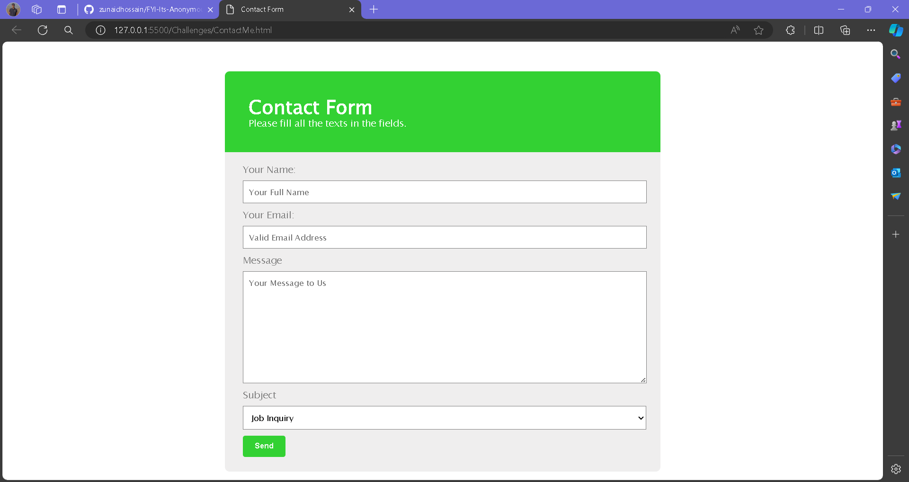

# SimpleContactMe
 

  

  <h3 align="center">A Simple Contact Me Form</h3>

## About The Project

A basic contact me form with 4 fields - Name, Email, Message and Subject (Drop-down Menu)
 
 

 
 
## Built With
* HTML
* CSS

## Author

* **Zunaid Hossain** - *A Tech Enthusiast* - [Connect with me on LinkedIn](https://www.linkedin.com/in/zunaid-hossain-70b891235/)

